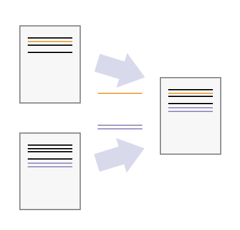

# Version control

Quick overview (more details [here](https://swcarpentry.github.io/git-novice/))

## Why should we use it?


Version control allows us to travel in time.


Version control allows us to collaborate writing code/documents and have multiple working copies of a document.


Version control allows us to easily merge changes in different working copies of a document.



## Setting up git

In the command line (or Git Bash on Windows) type

```
$ git config --global user.name <your_user_name>
$ git config --global user.email <your_email_address>
$ git config --global core.editor "nano -w"

```

## Creating a repository

First go to the directory you created in the Unix Shell part. In a terminal type

```
$ cd <pystarters>/myFirstRepo
```

Next, create a git repository by typing in the terminal

```
$ git init
```

Verify that git was initialized by typing

```
$ ls -a
```

which should show a `.git` directory.

## Tracking changes

The process used to add a file to version control is shown in the figure below


```
$ cd <pystarters>/myFirstRepo/code/scripts
```

```
$ git status
```

The “untracked files” message means that there’s a file in the directory that Git isn’t keeping track of. We can tell Git to track a file using git add:

```
$ git add myFirstScript.py
```

and then check that the right thing happened:

```
$ git status
```

Let's commit now

```
$ git commit -m "Added"
```

```
$ git status
```

## Remotes in GitHub

Github keeps a copy your local repository in the Internet.

Let's first create an empty repository in Github. 

1. Login to [Github](https://github.com/)
2. Click on the + sign on the top right

3. Name your repository "myPyStarters2021Repo" and then click "Create Repository'


We now have an empty GitHub repository


4. The next step is to connect the two repositories. We do this by making the GitHub repository a remote for the local repository. The home page of the repository on GitHub includes the string we need to identify it:

5. Got to your terminal and type

```
$ git remote add origin https://github.com/<your-github-username>/myPyStarters2021Repo.git
```
6. In the terminal type

```
$ git push -u origin master
```
We now have in GitHub a copy of our local repository


Check that myFirstScript.py is now in GitHub!!!

7. If someone updates the GitHub repository and you want to update your local repository use:

```
$ git pull
```


